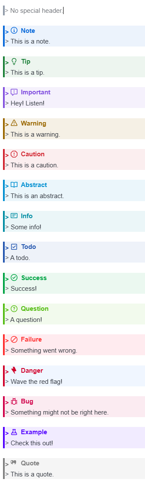

# Markdown Alerts and Formatting Commands

A Joplin plugin that adds the following functionality to the Markdown editor:

- renders GitHub-style alerts in the Markdown viewer and Markdown editor
- adds Markdown editor commands for alerts, blockquotes, and inline formatting (for markdown syntax that joplin's builtin formatting commands don't cover)


> [!NOTE]
> This plugin was created entirely with AI tools.

> [!CAUTION]
> The Rich Text Editor is not supported. Alerts may appear there, but editing in the Rich Text Editor will remove GitHub alert syntax.

## 1. GitHub Alert Rendering

The plugin supports GitHub-style alert syntax:

- Markdown viewer: alerts render as styled callouts using markdown-it-github-alerts
- Markdown editor: alerts are decorated as styled block quotes, with a title line showing the alert type (or custom title) and svg icon based on alert type (similar to the markdown-it-github-alerts styling in the viewer)

Supported alert types:

- `NOTE`
- `TIP`
- `IMPORTANT`
- `WARNING`
- `CAUTION`
- `ABSTRACT`
- `INFO`
- `TODO`
- `SUCCESS`
- `QUESTION`
- `FAILURE`
- `DANGER`
- `BUG`
- `EXAMPLE`
- `QUOTE`

Example:

```markdown
> [!NOTE]
> Useful information that users should know, even when skimming content.

> [!TIP]
> Helpful advice for doing things better or more easily.

> [!IMPORTANT]
> Key information users need to know to achieve their goal.

> [!WARNING]
> Urgent info that needs immediate user attention to avoid problems.

> [!CAUTION]
> Advises about risks or negative outcomes of certain actions.

> [!QUESTION] What if you could use a custom title?
> This alert uses a custom title
```



## 2. Markdown Editor Commands For Block Structures

The plugin adds toolbar buttons and Edit menu commands for:

- Insert or Toggle alert
- Insert or Toggle blockquote
- Clear Markdown formatting in selection

### Insert or Toggle alert

Default shortcut: `Ctrl + Shift + A`

Behavior:

- On an empty line, insert `> [!NOTE] ` and place the cursor after the marker
- If the cursor is inside an existing alert, cycle the alert type
- If the cursor is inside a regular blockquote, convert it into an alert
- With no selection, convert the current paragraph or line into an alert
- With a selection, convert the selected paragraphs or lines into an alert

### Insert or Toggle blockquote

Default shortcut: `Ctrl + Shift + .`

Behavior:

- On an empty line, insert `> ` and place the cursor after the marker
- With no selection, convert the current paragraph or line into a blockquote
- With a selection, convert the selected paragraphs or lines into blockquotes

### Clear Markdown formatting in selection

Default shortcut: none

Behavior:

- Works on the current non-empty selection ranges
- Removes supported markdown and inline HTML formatting syntax
- Removes GitHub alert marker lines like `> [!NOTE]` while preserving any custom alert title text
- Strips headings, blockquotes, ordered/unordered/nested lists, and task list markers back to plain text
- Converts external markdown links and image embeds to their raw URLs
- Preserves Joplin resource links and embeds that target `:/<32 hex>`

## 3. Inline Formatting Commands

Joplin supports various inline Markdown extensions, but the Markdown editor does not provide built-in commands for all of them. This plugin adds commands, toolbar buttons, and Edit menu entries for:

- Highlight: `==text==`
- Strikethrough: `~~text~~`
- Underline: `++text++`
- Superscript: `<sup>text</sup>` by default, optionally `^text^`
- Subscript: `<sub>text</sub>` by default, optionally `~text~`

Default shortcuts:

- Highlight: `CmdOrCtrl + Shift + Y`
- Strikethrough: `CmdOrCtrl + Shift + ~`
- Underline: `CmdOrCtrl + Shift + U`
- Superscript: no default shortcut
- Subscript: no default shortcut

### Command behavior:

- No active selection: insert the delimiter pair and place the cursor between them
    - If cursor is inside (or adjacent to) existing markdown formatted text:
        - cursor immediately before opening formatting tokens: move cursor inside
        - cursor immediately before ending formatting tokens: move cursor after
        - cursor otherwise inside formatting: remove formatting and select text
- Selected text already fully wrapped in the target format: remove the outer formatting
- Selection contains one or more inner spans already using the target format: remove only that target formatting
- Selection contains no target formatting: wrap the selection

For full-line selections, the inline formatting commands are line-aware instead of blindly wrapping the whole block:

- blank lines are preserved
- list markers are preserved
- blockquote markers are preserved
- heading markers are preserved
- task list markers are preserved
- fenced code blocks, tables, and horizontal rules are left alone
- leading and trailing spaces stay outside newly inserted delimiters

Examples:

```markdown
> - abc test
```

Highlight becomes:

```markdown
> - ==abc test==
```

```markdown
## Heading
```

Highlight becomes:

```markdown
## ==Heading==
```

## Settings

The plugin includes settings to enable or disable each editor toolbar button independently.

It also includes separate syntax settings for the superscript and subscript commands. Both default to inline HTML because Joplin renders that syntax in both the editor and the viewer.

Available toolbar visibility settings:

- Alert
- Blockquote
- Clear Formatting
- Highlight
- Strikethrough
- Underline
- Superscript
- Subscript

All toolbar buttons are enabled by default.

These settings only affect the editor toolbar buttons. The commands themselves, menu items, and shortcuts still remain available.

Changing a toolbar visibility setting currently requires restarting the plugin to take effect.
Changing the superscript or subscript syntax setting applies to commands immediately and does not require a restart.
